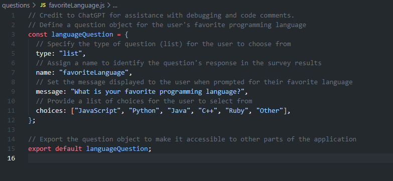
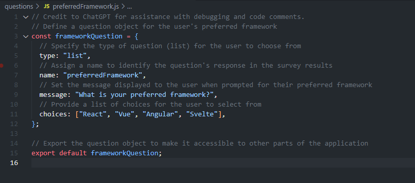
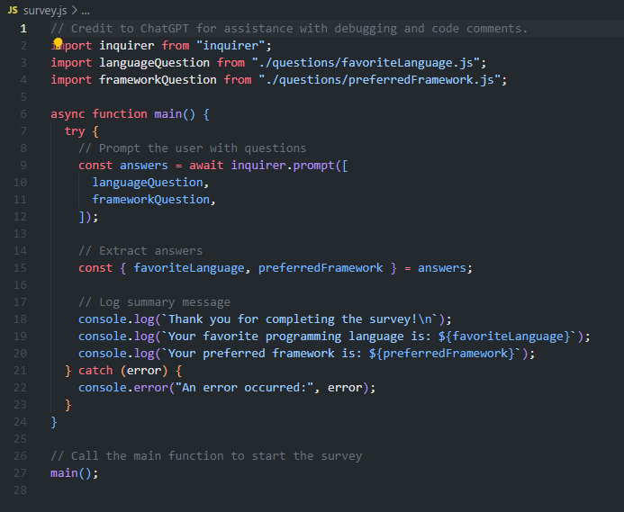

# Objective
Create a modular Node.js command-line survey tool that collects users' programming preferences using the Inquirer package. This tool will demonstrate your ability to structure code into modules for different survey questions and integrate user input handling in a cohesive application.

# Instructions
## Step 1: Initialize Project and Repository
### Create a GitHub Repository:

Name the repository Node-Assignment-3. Initialize it with a README and a .gitignore file for Node.js.

### Local Setup:

Clone the repository and navigate into it.
Run npm init -y to create a package.json file.
Install Inquirer with npm install inquirer.

## Step 2: Structure Your Survey
### Create Modules for Questions:

In your project, create a questions directory.
Inside questions, create modules (e.g., favoriteLanguage.js, preferredFramework.js) that export question objects for Inquirer. You will only need to export a JavaScript object for each module. See the example object:
```
questionObject = {
  type: 'list',
  name: 'operation',
  message: 'Which operation would you like to perform?',
  choices: ['add', 'subtract', 'multiply', 'divide'],
};
module.exports = questionObject;
```
  
  
  
## Step 3: Implement the Survey Tool
### Build the Main Survey Application (survey.js):

Import the Inquirer package and your question modules.
Use Inquirer to prompt the user with the questions imported from your modules.
  
  
## Step 4: Log User Responses
### Capture and Display Responses:

After collecting responses, log a summary to the console, thanking the user for their input and summarizing their preferences.

## Step 5: Document and Finalize
### Update README.md:

Describe the survey tool, how to run it, and the purpose of each module.
Push changes to GitHub, ensuring .gitignore is properly set up to exclude node_modules.

Description:
This is a simple tool that asks the user a question, records the user's answer, asks a second question, and likewise record's the user's answer, then displays both answers to the user in a console log.

To run this tool, simply:
- Clone this repository.
- Navigate to the repository directory.
- Open GitBash.
- Run the command "npm i inquirer".
- Run the command "npm survey.js".  
  
Each module represents its own question asked by survey.js.  

Credits:
Credit to ChatGPT for assistance, debugging, and code comments.